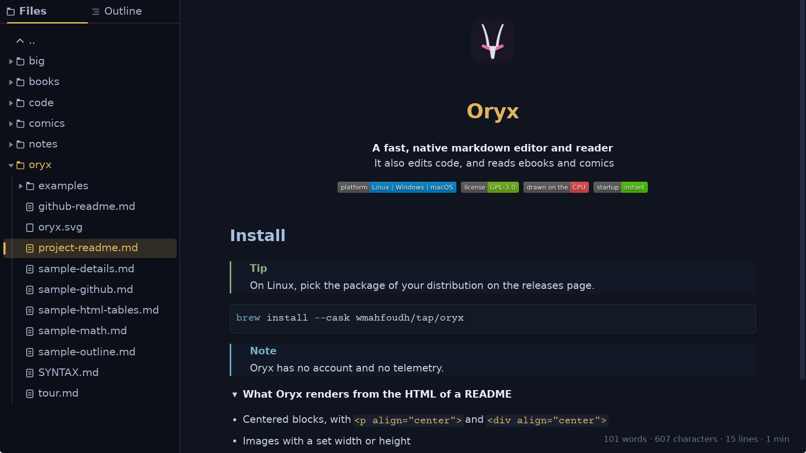
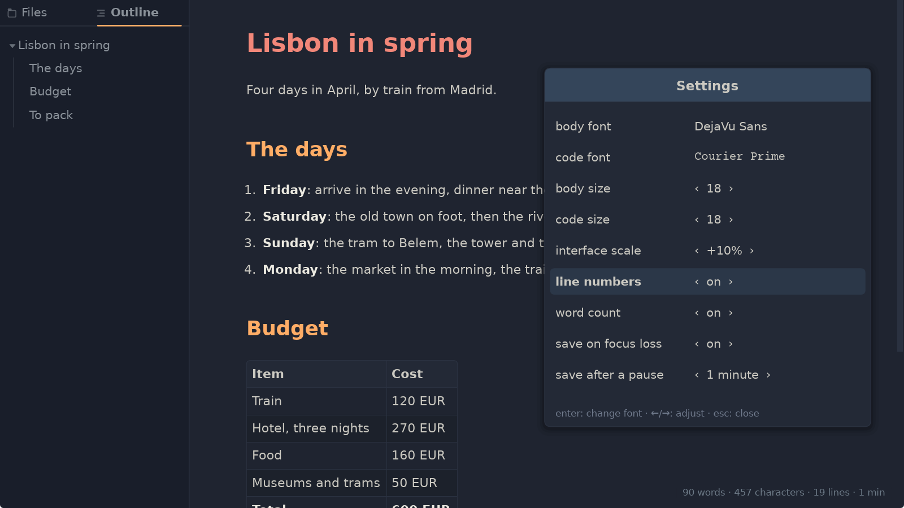
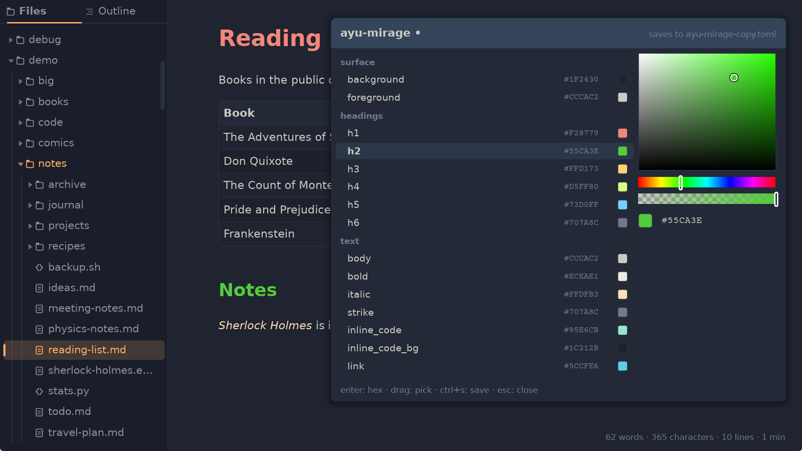
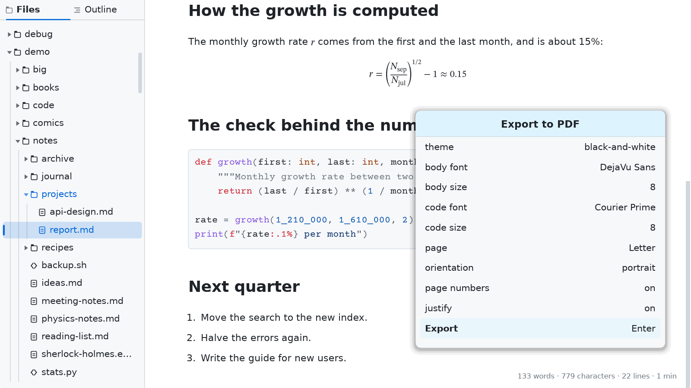

# Oryx features

Oryx is a fast editor for markdown and code, and a reader for ebooks and comics. This page describes what Oryx does, in more detail than the [README](README.md). The shortcuts are listed in [SHORTCUTS.md](SHORTCUTS.md), and [SYNTAX.md](SYNTAX.md) shows every markdown construct twice, as written and as rendered. Open SYNTAX.md in Oryx: some of its constructs are not supported by GitHub.

- [Markdown](#markdown)
- [Math](#math)
- [Diagrams](#diagrams)
- [Text and code](#text-and-code)
- [Ebooks](#ebooks)
- [Comics](#comics)
- [Reading tools](#reading-tools)
- [Editing](#editing)
- [Themes](#themes)
- [PDF export](#pdf-export)
- [The program](#the-program)

## Markdown

Oryx reads CommonMark and the GitHub Flavored Markdown extensions: tables, task lists, strikethrough, footnotes, alerts and math. It also reads the extended syntax listed by the Markdown Guide: heading IDs in braces, definition lists, subscript and superscript (`H~2~O`, `x^2^`), highlight (`==highlight==`) and abbreviations, whose expansion shows when the mouse is over them. Emoji shortcodes are replaced by the emoji: `:tada:` gives :tada:. The [examples](examples/) folder is installed with Oryx and shows the syntax in real documents.

Lists nest as deep as needed, and a wrapped line lines up with the text above it, not with the bullet. Tables keep the alignment of each column, shade every other row, and wrap long cells. A link to another file opens that file in Oryx.

The five GitHub alerts (note, tip, important, warning, caution) each have their own color and title. A YAML front matter block at the top of a file is shown as a small panel above the document.

Footnote markers are raised in the text and numbered in the order they are used. A click on a marker goes to its note at the end of the document, and a click on the note's number comes back. `Alt+Left` also comes back to where you were reading.

### Images and badges

Oryx shows PNG, JPEG, GIF, WebP and SVG images. Images linked by URL are downloaded in the background and saved on disk, so a file with badges opens immediately the second time and still shows them offline. A saved image older than a day is downloaded again the next time the file opens. When an image cannot be found, Oryx shows a placeholder with its alt text, or its file name when there is no alt text.

### Embedded HTML

Oryx renders the HTML that GitHub allows in a README: tables with or without a header row, collapsible `
` sections, HTML headings, lists and quotes, definition lists, blocks aligned left, center or right, images with a set width or height, rows of clickable badges, and inline tags such as `mark`, `kbd` and `small`. Search also looks inside closed sections, and going to a match opens the section.

## Math

Oryx typesets math written in TeX with the STIX Two Math font: fractions, roots, matrices, delimiters that grow with their content, and limits stacked above and below. STIX Two Math is used for math only, and is not in the font list of the settings. Oryx reads the four notations GitHub uses: `$...$`, `$$...$$`, a `math` code block, and ``$`...`$``. For example, `$E = mc^2$` gives $E = mc^2$. Oryx tells a dollar used for money from a dollar used for math, so `$5-$10` stays text.

The commands are compatible with KaTeX: Greek letters, operators, relations and their negations, arrows, accents, the math alphabets, operator names, spacing, the matrix environments, and `\newcommand` macros. An unknown command is shown as written, and the rest of the formula renders normally. A formula wider than the window is reduced to fit, within a limit.

Math is included in the PDF export, and text copied from the PDF reads back as the formula's characters. The supported commands are listed in [SYNTAX.md](SYNTAX.md#math), and [examples/sample-math.md](examples/sample-math.md) shows many of them in one document.

## Diagrams

A fenced `mermaid` block renders as the diagram itself: flowcharts, sequence, class, state, ER, mindmap, pie, timeline, gantt and git graphs, drawn by [Merman](https://github.com/Latias94/merman), a parity-oriented native Rust renderer — no browser engine, no JavaScript, no network. Diagrams follow the active theme, render off the UI thread and cache per source, so scrolling back to one costs nothing. A diagram wider than the column shrinks to fit, keeping its proportions, and a click on one opens it full size in the [viewer](#the-image-viewer). PDF export includes it. An invalid diagram shows an error panel in its place and the document reads on. The renderer tracks mermaid.js 11.15 as its compatibility baseline; as a separate implementation, the newest syntax forms may still differ. [SYNTAX.md](SYNTAX.md#diagrams) shows the syntax and [examples/sample-mermaid.md](examples/sample-mermaid.md) one of every kind.

## Text and code

Oryx opens source files and shows them with syntax colors, for more than a hundred file extensions, from Rust and Python to Terraform and Zig. Some files are recognized by their name, like `Dockerfile` or `Makefile`. A file without an extension gets its colors when its content says what it is: a script that starts with `#!`, a file with an editor modeline, a dotfile like `.bashrc` or `.gitconfig`, or a diff, JSON, XML or INI file recognized by its first lines. Any other text file opens in the code font.

In a markdown file, code blocks are shown in a panel with syntax colors, and a line too long for the window wraps inside the panel.

A diff shows its added lines in green, its removed lines in red and its `@@` lines in blue. The exact colors are those of the theme's alerts (tip, caution and note). This works for `.diff` and `.patch` files and for text piped from a command, like `git diff | oryx`.

Oryx opens text in UTF-8 only. A file in an older encoding is refused, and so is a binary file: a file whose first 8 KB contain a zero byte or are mostly unreadable.

## Ebooks

Oryx opens EPUB, FB2, MOBI and AZW3 (Kindle) books, and FB2 books zipped as `.fb2.zip` or `.fbz`. A book is shown as one continuous document, in your theme rather than in the book's own style. It keeps its structure: chapter headings, italics and bold (including those set by the book's stylesheet), images and the cover, tables and code. The first chapters show immediately, and the rest of the book loads in the background. The window title shows the book's title and its format, which helps when you have the same book in several formats.

Book text is justified: lines end at the same right edge, and the last line of each paragraph stays short, as in print. `Ctrl+J` turns justification off and on. Markdown files can be justified too. They start unjustified, and Oryx remembers the choice separately for books and for markdown.

The Outline tab of the sidebar shows the book's table of contents, highlights the chapter you are reading, and goes to a chapter on a click. Links inside the book work: a footnote reference goes to its note, `Alt+Left` comes back and `Alt+Right` goes forward again. A book opens again where you stopped reading, even after you close Oryx. Other files open at the top when Oryx starts.

Books protected by DRM and fixed-layout EPUB books are not supported. *The Adventures of Sherlock Holmes* is in the [examples](examples/) folder to try it.

### Arabic and Hebrew

Oryx reads books written from right to left. It finds the direction of each paragraph from its text, because book metadata is often wrong about it. In a book that mixes English and Arabic, each paragraph reads in its own direction. Justified Arabic fills the line to both edges, and the last line of each paragraph ends on the right, as in printed Arabic books. Lists, quotes and headings follow the direction of their text. Selection, search and PDF export work as in any other document.

Two fonts are built in for these scripts: Amiri for Arabic, a revival of the typeface classical Arabic books were printed in, and David Libre for Hebrew, a digital version of David, a typeface used in many Hebrew books. Arabic and Hebrew text always uses them, whatever body font you chose.

If Oryx gets the direction of a book wrong, `Ctrl+D` changes it: automatic, right to left, left to right. Oryx remembers the choice for each book.

## Comics

Oryx opens CBZ and CBR comics and shows the pages in reading order. A comic starts as a vertical strip with every page at the width of the window, which suits webtoons. `Ctrl+Minus` switches to one whole page per screen, and again to two pages side by side, like an open book. `Ctrl+Plus` goes back, and `Ctrl+0` shows the whole page from any view. In the page views, `Up`, `Down` and `Space` turn the pages.

For comics read from right to left, like manga, `Ctrl+D` reverses the order of the two pages, and Oryx remembers it for that comic. The outline lists the pages, and a comic opens again at the page where you stopped.

Oryx reads the content of the archive, not its name, so a `.cbr` file that is really a zip opens anyway. When an archive is protected by a password or damaged, Oryx says so. CBR comics whose pages are compressed inside the RAR archive are not supported.

## Reading tools

### Find

`Ctrl+F` finds text in the document. A search in lowercase ignores case, so `oryx` finds Oryx, ORYX and oryx, while a search with a capital letter, like `Oryx`, finds that exact spelling. A match can cross formatting, so `fast viewer` is found even when it was written `**fast** *viewer*`, and it can cross a wrapped line. The whole document can be searched while a big file is still loading.

`Alt+R`, or the `.*` button, switches to regular expressions, in the Rust `fancy-regex` flavor, with capture groups, backreferences and lookarounds. `^` and `$` match at the start and end of a line, and on the formatted page each block counts as one line. `\n` matches a line break. While a pattern is incomplete, the border of the search bar changes color instead of showing a count.

The search field works like a text box: `Ctrl+Left` and `Ctrl+Right` move by word, `Shift` selects, and `Ctrl+Backspace` and `Ctrl+Delete` delete a word. A double click selects a word, and a triple click selects the whole field. A click in the document closes the search bar.

### Select and copy

`Ctrl+C` copies the selection with its formatting. It pastes into an email or a Word document with its headings, lists, tables, quotes, links and code, and with its pictures and formulas as images. A terminal or a text editor gets plain text. `Ctrl+Shift+C` copies the markdown source of the selection.

A double click selects a word and highlights every other place where the same word appears. A triple click selects the paragraph, the line of code or the table cell, and a click with `Shift` held extends the selection to that point. Select all is instant whatever the size of the file. A selection stays when you zoom, change the theme or resize the window, and both kinds of copy work before a big file has finished loading.

### The image viewer

A click on a picture, or on a diagram, opens it alone over the page, as large as the window allows and at natural size when it is smaller. The wheel zooms under the pointer — the point of the picture under the cursor stays under it — from that fit up to eight times natural size; `0` goes back to the fit and `1` to natural size. While the picture is larger than the window, the arrow keys and a drag pan it, and a caption names the file, its size in pixels and the zoom. `Ctrl+C` copies the picture to the clipboard, pixels and size as they are. `Escape`, or a click away from the picture, closes the viewer.

The viewer opens at once, even on a camera photograph: the first frame shows the picture's own pixels, and the sharpened frame replaces it the moment the zoom or the pan stops. Zooming and panning never wait on a resample.

A picture wrapped in a link follows its link, and a picture still downloading stays a click away. A diagram shrunk to the width of the column shows its details in the viewer, and so do the pictures inside a book.

### Sidebar

`Ctrl+Shift+B` shows and hides the sidebar. It has two tabs: the files in the folder around the open file, and an outline of the document's headings. The outline highlights the heading you are reading, folds its branches, and goes to a heading on a click. For a book, the outline is its table of contents. Both tabs work with the keyboard: `Left` and `Right` move between the sidebar and the document, and `Ctrl+Tab` switches tabs.

The sidebar is open the first time you start Oryx, on your home folder. It follows the disk: a file added, removed or renamed by another program shows the next time you come back to the window. Files and folders whose name starts with a dot are hidden. `Ctrl+Shift+H` shows them, and Oryx remembers the choice. A folder reached through a symbolic link is listed, and opening it moves the sidebar to the real folder. A folder Oryx cannot read shows one line that says so, under the `..` line, so you can go back up.

### Second window

A middle click on a file in the sidebar, or `Ctrl+Enter` on the selected file, opens it in a second Oryx window, a little below and to the right of the first one. On Wayland, the desktop decides where it goes. The two windows share the settings and the reading positions of books, and each one saves only what it changed.

### Find files

Press `/` in the Files tab of the sidebar (or click the magnifier in the caption) and type: files match fuzzily across their whole path — `usrctrl` finds `src/user/UserController.rs` — ranked best first, with the matched characters highlighted. Case is smart, like the in-document search. `Enter` opens the selection, `Up` and `Down` move it, `PageUp` and `PageDown` page, and `Esc` returns to the tree; the mouse clicks, drags and scrolls the same list. The walk respects `.gitignore` and `.ignore`, skips hidden folders the way `fd` does, and runs off the UI thread, so a huge folder never freezes the panel.

### Search in files

`Ctrl+Shift+F` greps the folder the Files tab is rooted at, right in the tab itself. Plain queries are literal strings; `Alt+R` (or the `.*` toggle) switches to regular expressions in ripgrep's Rust `regex` flavor — linear-time and lookahead-free, unlike the in-document search's `fancy-regex`. Case is smart in both modes. Results stream in grouped by file with line numbers and the matched text highlighted; `Enter` (or a click) opens the file at the match. Binary files are skipped on their first NUL byte, and a file with unsaved edits is searched as it stands in the editor, not as it lies on disk. Both searches stay inside the folder the Files tab is rooted at, wherever you navigated it.

### Opening files

`Ctrl+O` opens the system's file dialog. You can also drop a file on the window to open it, a folder to show it in the sidebar, or a picture on a markdown file you are editing to add it to the file.

Started without a file, Oryx shows a short welcome page with the main shortcuts and a tip, a different one each time. A link under the tip shows the next one.

### Live reload

When another program changes the open file, Oryx reloads it the next time you come back to the window, as long as you have no unsaved edits. `F5` or `Ctrl+R` reload it at any time. If the file is deleted or moved by another program, a notice says so, the title shows the unsaved dot, and `Ctrl+S` writes the text back.

### Go to line

`Ctrl+G` opens a small field. Type a line number and press `Enter`, or `412:10` to go to the tenth character of line 412. From a terminal, `oryx main.rs:412` or `oryx main.rs:412:10` opens the file there.

### Line numbers and word count

Both are off by default and turned on in the settings (`Ctrl+,`).

Line numbers show in the margin of code and text files, and of a markdown file while you edit it. In the editor, the number of the current line is shown in a small box. The formatted page and the PDF stay without line numbers.

Word count shows the words, characters, lines and reading time in the bottom right corner, for the whole file or for the selection. It counts the text as the page shows it, without the markdown marks. For a code file, it shows the lines and characters.

### Zoom, display scale and touch

`Ctrl+Plus` and `Ctrl+Minus` zoom in and out, and so does the mouse wheel with `Ctrl` held.

Oryx follows the scale of your display, so text and controls have the intended size on a scaled screen, like a laptop at 200%. The `interface scale` setting adjusts this size from -50% to +100%, and Oryx remembers it.

On a touch screen, a swipe scrolls the document, the sidebar and the dialogs, and keeps scrolling for a moment when released while moving. A tap clicks, and pinching with two fingers zooms the document.

### Dialogs

A dialog closes with `Escape`, or with a click outside it.

### What Oryx remembers

The size and position of the window, the theme, the sidebar and the last folder are restored each time Oryx starts. While Oryx is open, each file you switch away from comes back as you left it: a file you were editing comes back in the editor, at the same spot, and a code file at the line you were reading.

## Editing

Oryx is a full editor, made for the keyboard. For markdown, it has everything you need to write. For code, it is made for quick edits and is not designed to compete with code editors like VS Code or Zed.

### Edit mode

`Ctrl+E` switches to editing, and `Escape` or `Ctrl+E` again switches back to reading. While you edit, the title says `editing` and a thin line in the selection color runs along the top of the page.

Code and text files are edited directly on the page. A markdown file shows its source, in the colors of the theme, with the markdown marks visible. When you go back to reading, the page shows your changes. The line you are on stays at the same height on the screen in both directions.

An empty file opens directly in the editor. Books cannot be edited, and neither can a file whose text could not be read cleanly, because Oryx could not write it back as it was. A notice in the corner says so.

### Writing

The usual keys work: typing, selecting, `Ctrl+X` and `Ctrl+V`, `Ctrl+Z` to undo, `Ctrl+Shift+Z` or `Ctrl+Y` to redo. Typing stays instant in very large files.

`Ctrl+Left` and `Ctrl+Right` move by word, `Ctrl+Home` and `Ctrl+End` go to the start and the end of the file, and `Ctrl+Backspace` and `Ctrl+Delete` delete a word. `Up` on the first line goes to its start, and `Down` on the last line goes to its end.

With nothing selected, `Ctrl+C` copies the whole line, `Ctrl+X` cuts it, and `Ctrl+V` puts it back as a new line above the current one.

With text selected, typing a bracket or a quote wraps the selection instead of replacing it. In a markdown file, `*`, `_` and a backtick do the same.

`Alt+Up` and `Alt+Down` move the line or the selected lines, `Ctrl+Shift+D` duplicates them, `Ctrl+Shift+K` deletes them, and `Ctrl+/` comments them out in the style of the language. Each of these is undone with one `Ctrl+Z`.

`Alt+Left` and `Alt+Right` go back and forward between the places you jumped from, in the editor too.

### Markdown helpers

`Ctrl+B`, `Ctrl+I` and `` Ctrl+` `` make the selection, or the word under the cursor, bold, italic or code. The same key removes the formatting. With nothing selected, press the key, type, and press it again to continue in plain text.

`Ctrl+K` makes the selection, or the word under the cursor, a link, and puts the cursor where the address goes. When the selection is itself a web address, it becomes the address of the link, and the cursor goes where the text goes. Pasting a web address over a selection also makes a link.

`Alt+-`, `Alt+1` and `Alt+X` turn the selected lines into a bullet, numbered or task list, and `Alt+.` turns them into a quote. `Ctrl+1` to `Ctrl+6` set the heading level of the line. `Ctrl+L` ticks or unticks the task of the line. A task can also be ticked with a click on the formatted page, without going into the editor.

`Enter` keeps the indentation and continues what you are writing: the next list marker, an empty task, or the `>` of a quote. `Enter` on an empty item ends the list. `Shift+Enter` adds a line break inside a paragraph or a list item.

`Tab` indents and `Shift+Tab` removes an indent, on every selected line. On a list item, `Tab` nests it under the item above, inside a quote too. A first item stays where it is, so a list never turns into a code block by accident. A new markdown file indents with four spaces, and an existing file keeps the indentation it uses.

`Ctrl+V` pastes a picture from the clipboard. Oryx saves it as a PNG in an `images` folder next to the file, writes the link, and puts the cursor where the description goes. A picture dropped on the file is added the same way, and a picture already inside the file's folder is linked where it is. A big picture is reduced to 2560 pixels on its longer side, and `Ctrl+Shift+V` pastes it at its full size.

### Find and replace

`Ctrl+H` opens a second field under the search field, and `Tab` moves between the two. `Enter` replaces the current match and goes to the next one. `Ctrl+Enter` replaces every match at once, and one `Ctrl+Z` brings them all back.

With regular expressions, the replacement can reuse the captured groups. Searching `(\w+)/(\w+)` and replacing with `$2/$1` swaps the two sides of every pair. In the replacement, `\n`, `\t` and `\\` write a line break, a tab and a backslash.

The replace field only exists in the editor. Search works everywhere.

### Saving

`Ctrl+S` saves. Lines you did not touch are written back unchanged, and each line keeps its own line ending, so a Windows file or an old Mac file stays as it was. A dot next to the file name in the title means there are unsaved changes. `Ctrl+Shift+S` saves under a new name, also while reading.

Autosave is off by default and has two settings (`Ctrl+,`). `save on focus loss` saves the file when you switch to another window, and `save after a pause` saves it once you stop typing for the time you choose, from 5 seconds to 15 minutes. Autosave never writes over a change another program made to the file: Oryx tells you and waits for your `Ctrl+S`.

Closing, quitting or reloading with unsaved changes asks first: `S` saves, `D` discards, `Escape` goes back to editing. If another program changes the file while you have unsaved edits, Oryx shows a notice and leaves your edits alone. If the file is deleted or moved, `Ctrl+S` writes it back.

### New files and notes

`Ctrl+N` creates a new file. The save dialog opens first, so Oryx knows the type of the file and its syntax colors, then the empty page is ready for typing.

`Ctrl+M` opens an empty markdown note in the editor, with no dialog. You choose its name and place the first time you press `Ctrl+S`. Until then, the note counts as unsaved work, and Oryx asks before closing or opening another file.

Oryx keeps a copy of the note while you type. If Oryx closes without asking, after a crash or a power cut, the next start offers the note back: `R` recovers it, `D` discards it, and `Escape` keeps it for later.

## Themes

Oryx comes with 33 themes, 11 of them made for Oryx. A theme is a TOML file that sets 51 colors, so every markdown element can have its own color.

`Ctrl+T` opens the list of themes. The arrow keys move through the list and show each theme on your document, `Enter` keeps the selected theme, and `Escape` goes back to the one you had.

In the list, each theme has small icons at its right: one opens the theme in the theme editor, and one duplicates it. A custom theme also has a cross that deletes it, and a double click on its name renames it.

The theme editor changes any of the 51 colors with a color picker, and the document updates as you change them. Editing a theme that ships with Oryx creates a copy, so the original stays unchanged. Your themes are saved in `~/.local/share/oryx/themes` on Linux, in `%APPDATA%\oryx\themes` on Windows (with the MSI or the zip) and in `~/Library/Application Support/oryx/themes` on a Mac. Oryx also reads the themes installed by a package, in folders like `/usr/share/oryx/themes`.

The 11 original themes are `oryx-light` and its dark twin `oryx-dark`, `oryx-hero`, `oryx-sand`, `oryx-night`, `inkstone`, `ember`, `meadow`, `slate`, `be-vendible`, and `black-and-white`, made for printing. The others adapt the palettes of well-known editor themes, credited in the [README](README.md#credits).

> [!TIP]
> To make a theme from a picture or a website you like, give an existing theme file to an AI model like Claude or Gemini, describe or link what you like, and ask it for an Oryx theme.

## PDF export

`Ctrl+Shift+P` opens the export settings: theme, body font and size, code font and size, page size, orientation and page numbers. The page sizes are A4, Letter, Legal and three book sizes. For a markdown file or a book, a setting turns justification on or off. The export settings are separate from the settings you read with, and Oryx remembers them. This way you can read in a dark theme at 22 points and export in a light theme at 11 points without switching each time.

`Ctrl+P` exports the document with these settings, and is the key you will use most once they are set. The PDF uses the same engine that draws the page, so it has the same layout, fonts, syntax colors and math. The headings are converted to PDF outlines, the fonts are embedded, and emoji are drawn as images. A book is exported with each chapter on a new page, and its table of contents becomes the PDF outline.

To start a new page in a markdown file, write `\newpage` or `

` on a line of its own. The PDF starts a new page there, and the screen shows a dashed line. [SYNTAX.md](SYNTAX.md) shows the other ways to write a page break.

When it cuts the document into pages, Oryx avoids:

- cutting a line across two pages
- leaving a heading alone at the bottom of a page
- cutting an image
- splitting a table row across two pages (unless the row is taller than a page)

## The program

Oryx is one binary, with a folder of themes and a folder of examples. It has no browser engine and no runtime. The themes and the syntax colors come with it, so nothing has to be downloaded. The Windows release is compiled on my Linux machine.

A few choices are opinionated:

- Nobody renders justified markdown :smile: (`Ctrl+J` turns it on and off).
- Most ebook readers do not dare to strip the book's CSS and apply their own. Oryx does.
- No buttons and no menu bar: Oryx is used from the keyboard.
- The default fonts for Latin, Arabic and Hebrew are built in (you can still pick a font of your system).

This fork adds Mermaid diagrams rendered natively by Merman, and workspace search in the sidebar's Files tab. Fork maintenance and upstream upgrades: [docs/UPSTREAM_SYNC.md](docs/UPSTREAM_SYNC.md).
