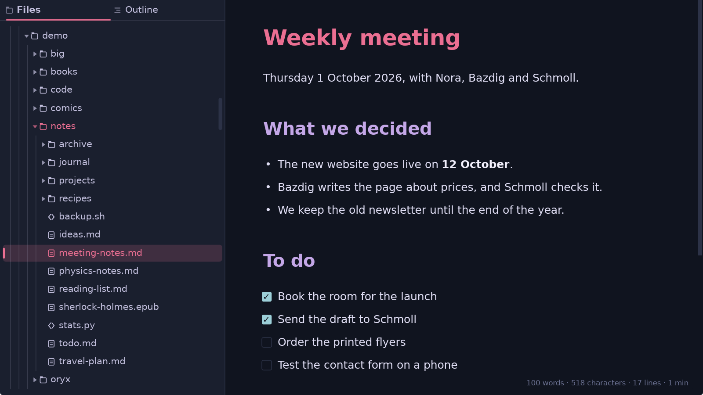
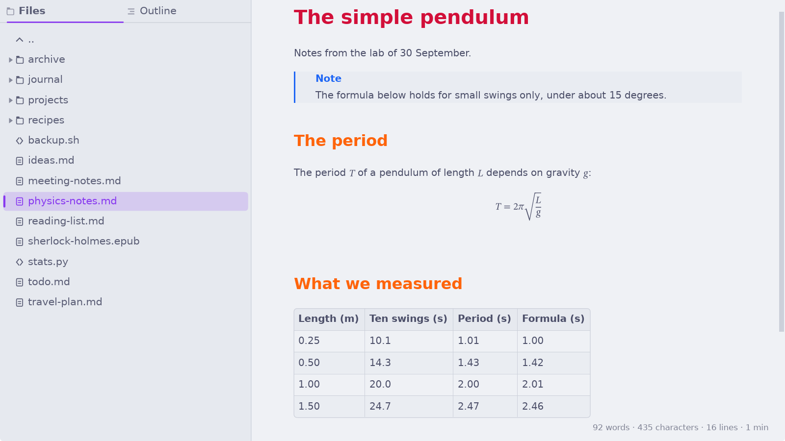
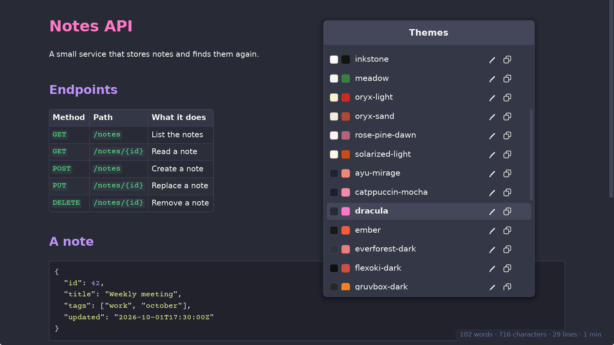
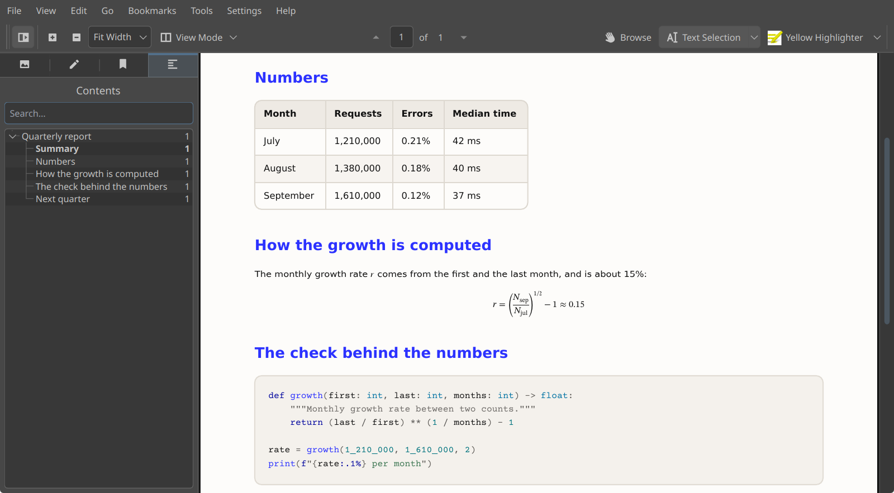
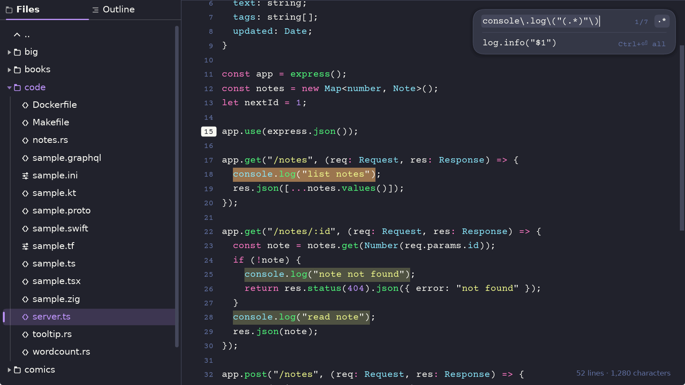
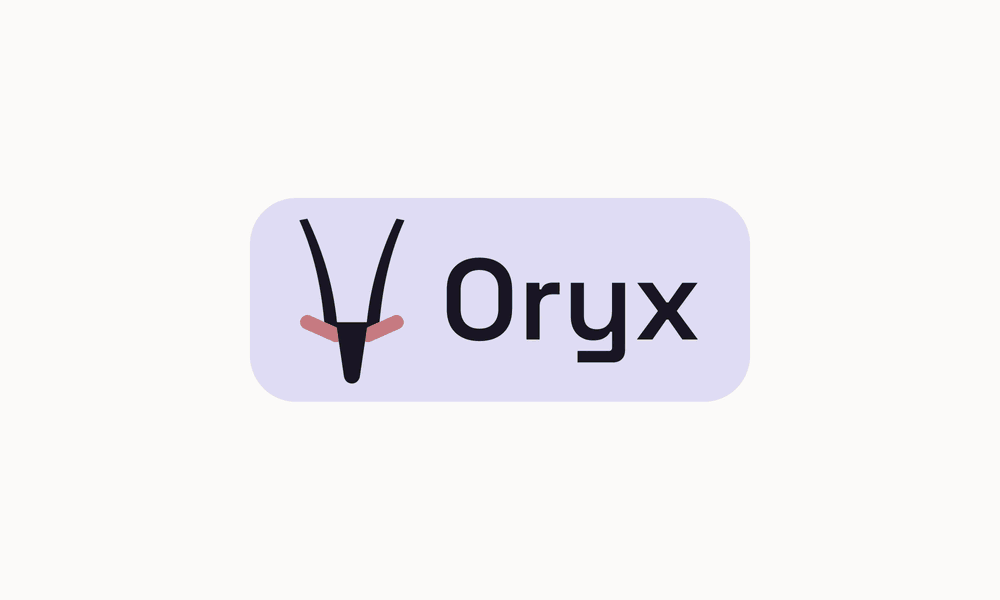

<div align="center">

<!-- WORDMARK: the logo and "Oryx" side by side, on a rounded rectangle. wordmark-dark.svg has light text on a dark rectangle (dark mode), wordmark-light.svg has dark text on a light rectangle (light mode). -->
<h1 align="center">
<picture>
  <source media="(prefers-color-scheme: dark)" srcset="images/wordmark-dark.svg">
  <source media="(prefers-color-scheme: light)" srcset="images/wordmark-light.svg">
  
</picture>
</h1>

**A fast, native markdown editor and reader.**<br>
It also edits code, opens ebooks and comics, on Linux, Windows and macOS.

<a href="https://github.com/wmahfoudh/oryx/releases"></a>
<a href="https://www.rust-lang.org"></a>
<a href="LICENSE"></a>

[Install](#install) · [Features](FEATURES.md) · [Shortcuts](SHORTCUTS.md) · [Changelog](CHANGELOG.md)

<!-- GIF: the main demo (oryx-main.txt), about 47 s, 2000x1200, under 5 MB. -->


</div>

Oryx is a markdown editor and reader, made for a keyboard workflow. It also edits code and reads ebooks and comics. Oryx opens a file in reading mode, and `Ctrl+E` switches between reading and editing. With no menus and no toolbars, it suits those who want to focus on the content and on writing. Oryx is a native app with its own rendering engine (no browser inside), built for speed and beauty: an 8 MB markdown file shows in **milliseconds**.

## Install

<a href="https://apps.microsoft.com/detail/9NQGHNSJF3VB"><picture><source media="(prefers-color-scheme: dark)" srcset="https://get.microsoft.com/images/en-us%20light.svg"></picture></a>

Every package is on the [releases page](https://github.com/wmahfoudh/oryx/releases). Pick the one for your system:

- **Windows**: the Microsoft Store (badge above), the MSI installer, or the zip to install in your user folder without administrator rights.
- **macOS**: `brew install --cask wmahfoudh/tap/oryx`, or the `.dmg`. The app is not signed, so macOS asks you to approve it once ([how](INSTALL.md#macos)).
- **Debian and Ubuntu**: `sudo apt install ./oryx-editor_*_amd64.deb`
- **Fedora and openSUSE**: `sudo dnf install ./oryx-editor-*.x86_64.rpm` (on openSUSE, `zypper` in place of `dnf`)
- **Arch Linux**: `sudo pacman -U oryx-editor-bin-*.pkg.tar.zst`
- **Any Linux**: the AppImage, or the tarball with its install script.

On Linux, the command is `oryx`. On Windows and macOS, the installers do not add a terminal command (for the moment): [INSTALL.md](INSTALL.md#from-a-terminal) says how to call Oryx there. [INSTALL.md](INSTALL.md) also covers the requirements and building from source.

## What Oryx does

### Fast with any file size

When you open a file, Oryx lays out only the first screens and shows them. The rest of the file is read and laid out in the background, on all CPU cores. Scrolling does not make memory grow, because Oryx draws only the part of the document around the current position. A window that is not doing anything uses no CPU. This is why Oryx runs fine on an old laptop with no graphics card. I do check Oryx [performance](#performance) before every release.

### Uses the file system

Oryx opens files where they already are on your disk. There is no vault, no library and nothing to import. It's really up to you to organize your content the old simple way: in files and folders. You open a file from the sidebar, with `Ctrl+O`, by dropping a file or a folder on the window, or from a terminal with `oryx notes.md`. The sidebar shows the folder you are in, and an outline of the open file.

Oryx opens files fast enough that it does not need tabs: you save, click another file in the sidebar, and when you come back, it remembers your location in the previous file. `Alt+Left` and `Alt+Right` go back and forward between the files you opened, or between locations in the same file just like in a browser. You can middle click on a file in the sidebar, or press `Ctrl+Enter`, to open it in another Oryx instance.

<p align="center"></p>

### All the Markdown, and more

Oryx reads CommonMark and GitHub Flavored Markdown: tables, task lists, strikethrough, footnotes, alerts and math. It also renders the HTML that GitHub allows in a README, like centered blocks, badges and collapsible sections, so a README looks in Oryx the way it looks on GitHub. Remote images and badges are saved on disk: they still show when you are offline.

Oryx also reads the extended syntax of the Markdown Guide, which GitHub does not: highlight, subscript and superscript, definition lists and abbreviations. Math written in TeX is typeset with the STIX Two Math font, and it looks the same in the PDF. [SYNTAX.md](SYNTAX.md) shows every supported construct. `F1` opens a mini help that shows the same reference and Oryx shortcuts.

<p align="center"></p>

### Themes and PDF export

Oryx comes with 33 themes, 11 of them made for Oryx. Each theme sets 51 colors, so every markdown element can have its own color. `Ctrl+T` opens the list of themes: navigating the themes shows a live preview on the open document, `Enter` keeps it and `Escape` cancels. The theme editor lets you create new themes and edit existing ones, also with a live preview.

`Ctrl+P` exports the document to PDF. The PDF is made by the same engine that draws the page, so it has the same layout, fonts, syntax colors and math, and the headings are converted to PDF outlines. Oryx avoids cutting a line, an image or a table row across two pages, and does not leave a heading alone at the bottom of a page. The export has its own theme, fonts and page size, set with `Ctrl+Shift+P`, so you can read in a dark theme and export in a light one without switching each time. A `black-and-white` theme exists, in case you prefer to have monochrome PDFs.

<p align="center"></p>

<p align="center"></p>

### Text and code, for quick edits

Oryx opens any text file, and supports syntax colors in source files for more than a hundred extensions. Files without an extension, like `.bashrc` or a script that starts with `#!`, are recognized too.

From a terminal, `oryx main.rs:412:10` opens a file at line 412, column 10, and `git diff | oryx` shows a diff in color.

`Ctrl+E` enters edit mode, with the tools of a code editor: move, duplicate or delete lines, comment out in the style of the language, find and replace with or without regular expressions, go to a line, and show line numbers. Saving keeps the line endings of the file, so a Windows file stays a Windows file.

For everyday text files, Oryx is a good replacement for Notepad, Notepad++ and similar editors. In terms of features, Oryx is not designed to compete with specialized code editors like VS Code or Zed: it has no git integration, no agentic workflow and no plugins.

<p align="center"></p>

### Ebooks and comics

Oryx opens EPUB, MOBI, AZW3 (Kindle) and FB2 books. It shows them in the active theme and fonts instead of the book's own style, and justifies the text like a printed book (`Ctrl+J` turns it off). The sidebar shows the book's table of contents, and Oryx remembers your last reading position. To try it, *The Adventures of Sherlock Holmes* comes with Oryx in the examples folder.

Oryx supports RTL for Arabic and Hebrew. Oryx finds the direction of each paragraph from its text, so in a book that mixes English and Arabic, each paragraph reads in its own direction. Two fonts made for these scripts are built in: Amiri for Arabic and David Libre for Hebrew.

Oryx also opens CBZ and CBR comics. A comic starts as a vertical strip of pages, which suits webtoons. `Ctrl+Minus` switches to one page per screen, and again to two pages side by side, like an open book. `Ctrl+D` toggles the page order for manga.

<p align="center"></p>

<p align="center"></p>

## Keyboard

Oryx has no menus and no toolbars. Everything is done with the keyboard and mouse, using familiar shortcuts like `Ctrl+F` to find, `Ctrl+S` to save, `Ctrl+B` for bold, etc. The keyboard flow has no modes and is certainly less powerful than what Vim can offer, but it's a good compromise that can accommodate most people.

A few rules hold everywhere: `Escape` closes whatever is open (when nothing is open, it quits Oryx), formatting shortcuts are toggles and in the dialogs the arrow keys move and change values. `F1` shows the full list of shortcuts and the supported markdown syntax, and can be searched. The shortcuts and the command line options are also listed in [SHORTCUTS.md](SHORTCUTS.md).

<!-- GIF: the editor tricks (editor-tricks.txt), one part or the three, under 5 MB. -->


| Key | What it does |
|---|---|
| `Ctrl+E` | Switch between reading and editing |
| `Ctrl+O` | Open a file |
| `Ctrl+Shift+B` | Show or hide the sidebar |
| `Ctrl+F` | Find in the document |
| `Ctrl+G` | Go to a line:column |
| `Alt+Left` / `Alt+Right` | Back and forward |
| `Ctrl+T` | Choose a theme |
| `Ctrl+,` | Settings: fonts, sizes, line numbers, word count, autosave |
| `Ctrl+P` | Export to PDF |
| `Ctrl+Shift+P` | PDF export settings |
| `F1` | All shortcuts and the markdown syntax |

On macOS, use `Cmd` where this page says `Ctrl`, and `Cmd+[` / `Cmd+]` to go back and forward.

## Is Oryx for me?

Oryx is for people who want to read and write markdown fast, with the keyboard, in one window. It shows a file formatted, themed, as soon as you open it, and it performs well with huge files. Oryx also opens and edits code, and reads books and comics: it's a consequence of being a markdown viewer and editor as it uses the same engine with some tweaks.

Oryx suits work with LLMs and coding agents, which write a lot of markdown. It reloads a file that changed on disk as soon as you come back to the window, so an agent's plan or report shows formatted and up to date. `llm "your question" | oryx --as md` shows an answer piped from the terminal.

For other needs, other tools might be a better fit:

- Linked notes, a graph of notes, plugins or sync: Obsidian.
- Editing inside the formatted text: Typora or MarkText.
- The source and the preview side by side: Ghostwriter, or VS Code with its preview.
- A full code editor with extensions, git and language servers: VS Code or Zed.
- A library to organize and convert ebooks: Calibre.
- Markdown in the terminal: Glow or Neovim.

## Performance

Every release is measured on my machine, a 2019 laptop with an Intel Core i7-8565U, 16 GB of memory, an NVMe drive and no dedicated graphics card. A release ships only if it is as fast as the previous one, or slower for a reason I can explain. The tables below come from the last measure.

The first table is about time. "First screen" is the time from reading the file to showing it, and it stays at 40 ms whatever the size of the file. The next three columns are work Oryx does in the background while you read: reading the markdown of the rest of the file (a source file has none, hence 0 ms), laying out the rest of the file, and coloring the code. "PDF export" is the export of the whole file.

| File | First screen | Rest read | Rest laid out | Code colors | PDF export |
|---|---|---|---|---|---|
| 1 MB markdown | 40 ms | 31 ms | 0.18 s | 0.65 s | 0.95 s |
| 1 MB source code | 40 ms | 0 ms | 0.11 s | 2.7 s | 0.84 s |
| 8 MB markdown | 40 ms | 256 ms | 1.5 s | 5.7 s | 8.8 s |
| 8 MB source code | 40 ms | 0 ms | 0.85 s | 24.2 s | 7.7 s |

The second table is about memory. "Once loaded" is what the file takes once all of this is done. "Highest" is the most it takes on the way there. "PDF export" is what an export adds while it runs.

| File | Once loaded | Highest | PDF export |
|---|---|---|---|
| 1 MB markdown | 22 MB | 34 MB | +10 MB |
| 1 MB source code | 11 MB | 12 MB | +11 MB |
| 8 MB markdown | 172 MB | 255 MB | +34 MB |
| 8 MB source code | 88 MB | 95 MB | +11 MB |

Books open the same way: the first chapters show at once, and the rest loads in the background. The third table gives the time before the first chapters of a book, or the first pages of a comic, show.

| Book | Format | Opens in |
|---|---|---|
| *The Adventures of Sherlock Holmes* | EPUB | 4 ms |
| A book of 300 chapters (1.6 MB) | FB2 | 27 ms |
| A book of 300 chapters (1.6 MB) | MOBI | 14 ms |
| A comic of 40 pages | CBZ | 1 ms |
| The same comic | CBR | 7 ms |

The 211 pages of *The Adventures of Sherlock Holmes* export to PDF in 0.8 s.

My goal is to make Oryx one of the fastest markdown editors and renderers. I benchmark Oryx performance against itself but also against other tools to improve it. The Oryx self-test files and the measures are in the repository:

```sh
cargo test --release --test perf -- --ignored --nocapture --test-threads=1      # the timings
cargo test --release --test perf_mem -- --ignored --nocapture --test-threads=1  # the memory
```

> [!NOTE]
> Oryx is not a markdown-to-PDF converter. Its export reproduces themed pages, at a few milliseconds per finished page whatever the document size. Raw conversion is a far faster job: a few milliseconds for a whole small file.

## Privacy

Oryx has no account and no telemetry. It does not report what you open, what you do, or that it is installed. It uses the network to download the images that a markdown file links to by URL, like the badges of a README. These images are kept on your disk so the file opens fast the next time, and `oryx --clear-cache` removes them. More details in [PRIVACY.md](PRIVACY.md).

## Limitations

- Oryx opens text files in UTF-8 only. A file in an older encoding, like Windows-1252 or Shift JIS, is refused rather than shown wrong. Binary files are refused too.
- Books protected by DRM and fixed-layout EPUB books are not supported. CBR comics open when their pages are stored in the RAR archive without compression, which is the usual case.
- Oryx renders the HTML that GitHub allows in a README, plus page breaks and aligned blocks. It does not apply CSS and does not render whole HTML pages.
- Typing works with any keyboard layout, but the input methods for Chinese, Japanese and Korean are not supported.
- On a file of several megabytes, the rest of the file is laid out and colored in the background, so a few lines can change color a moment after you reach them. A PDF export waits for this coloring to finish.
- On Linux, Oryx needs glibc 2.35 and OpenSSL 3, which recent distributions have ([the list](INSTALL.md#requirements)).
- The Mac build is made on GitHub's Mac machines and tested by some nice Mac users (thank you!).

## Why Oryx?

Oryx started as a personal project. I read and write a lot of markdown files, and I tried many of the free solutions. Most take time to open, and slow down or crash on large files. Many are built on Electron or a browser engine, which makes them heavy for a fraction of what they offer. My ideal would have been a portable desktop app that shows formatted markdown, opens instantly on any machine and does not share my notes with somebody on the other side of the planet. A good-looking PDF export would have been a plus. The closest was Obsidian, but the vault constraint broke my flow.

So Oryx began as a renderer, not as an editor. Most markdown editors show the source and then render it. I think a document should first open formatted. A browser does not start by showing the raw HTML, right? Editing came later, as a consequence, then ebooks and comics, because the same engine could do them. Some ideas were explored and left out: reading PDF files would have added 5.5 MB to the app without doing any better than the existing readers. Git and AI agent integration will probably never come. Any new feature has to keep Oryx `Fast and Beautiful`.

## Feedback

Bug reports and ideas are welcome in the [issues](https://github.com/wmahfoudh/oryx/issues). For a bug, the version (`F1`), your system, and if possible the file that shows the problem (or part of it) with some screenshots would be very helpful.

## Credits

Five fonts are built into Oryx: DejaVu Sans for text, Courier Prime for code, STIX Two Math for math, Amiri for Arabic and David Libre for Hebrew. DejaVu is under the DejaVu Fonts License, the other four under the SIL Open Font License. The settings (`Ctrl+,`) can switch the text and code fonts to any font installed on your system.

The sample book in [examples](examples/) is the [Standard Ebooks](https://standardebooks.org) edition of *The Adventures of Sherlock Holmes*, in the public domain and dedicated with CC0 by its producers.

<details>
<summary><b>Adapted theme palettes</b> (all MIT, with thanks to their authors)</summary>

- Dracula ([draculatheme.com](https://draculatheme.com))
- Nord ([nordtheme.com](https://www.nordtheme.com))
- Gruvbox dark and light ([morhetz/gruvbox](https://github.com/morhetz/gruvbox))
- Catppuccin Mocha and Latte ([catppuccin.com](https://catppuccin.com))
- Tokyo Night ([enkia/tokyo-night-vscode-theme](https://github.com/enkia/tokyo-night-vscode-theme))
- Solarized dark and light by Ethan Schoonover ([ethanschoonover.com/solarized](https://ethanschoonover.com/solarized))
- One Dark ([atom](https://github.com/atom/atom))
- Everforest dark and light ([sainnhe/everforest](https://github.com/sainnhe/everforest))
- Rosé Pine and Rosé Pine Dawn ([rosepinetheme.com](https://rosepinetheme.com)). `oryx-hero` also uses the accent colors of Rosé Pine.
- Kanagawa ([rebelot/kanagawa.nvim](https://github.com/rebelot/kanagawa.nvim))
- Ayu Mirage and Light ([ayu-theme](https://github.com/ayu-theme/ayu-colors))
- Night Owl by Sarah Drasner ([sdras/night-owl-vscode-theme](https://github.com/sdras/night-owl-vscode-theme))
- Horizon ([jolaleye/horizon-theme-vscode](https://github.com/jolaleye/horizon-theme-vscode))
- Flexoki dark and light by Steph Ango ([stephango.com/flexoki](https://stephango.com/flexoki))
- GitHub Light ([primer/primitives](https://github.com/primer/primitives))

</details>

<details>
<summary><b>Bundled grammars</b> (beyond syntect's defaults, with thanks to their authors)</summary>

- TOML ([sublimehq/Packages](https://github.com/sublimehq/Packages))
- INI ([jwortmann/ini-syntax](https://github.com/jwortmann/ini-syntax), MIT)
- Kotlin ([guille/sublime-kotlin](https://github.com/guille/sublime-kotlin), public domain)
- Swift ([aerobounce/Swift-Next](https://github.com/aerobounce/Swift-Next), MIT)
- TypeScript and TSX, Microsoft's grammars (Apache-2.0) as converted by [bat](https://github.com/sharkdp/bat)
- Dockerfile ([keith-hall/Containerfile-sublime-syntax](https://github.com/keith-hall/Containerfile-sublime-syntax), MIT)
- Zig ([ziglang/sublime-zig-language](https://github.com/ziglang/sublime-zig-language), MIT)
- Terraform and HCL ([alexlouden/Terraform.tmLanguage](https://github.com/alexlouden/Terraform.tmLanguage), MIT)
- GraphQL ([dncrews/GraphQL-SublimeText3](https://github.com/dncrews/GraphQL-SublimeText3), MIT)
- Protocol Buffers ([VcamX/protobuf-syntax-highlighting](https://github.com/VcamX/protobuf-syntax-highlighting), MIT)

Each grammar ships with its license text beside the source under `assets/syntaxes/`.

</details>

<br>

<div align="center">

Oryx is free software, released under the [GNU General Public License v3.0](LICENSE).

</div>
