# Mermaid theme showcase

Every diagram family, under every theme. This is the visual QA file:
after upgrading Merman, the theme system, or resvg, open this document
in Oryx and walk it once per theme in the Theme Browser.

What to look for, family by family:

- **Structure follows the theme's surfaces.** Node, actor, entity,
  class, state, requirement, cluster and note boxes paint the reading
  theme's own surface colors — never the link/syntax/alert accents.
- **Relationship and edge labels sit on a quiet ground.** The ER
  `contains` label and the requirement `satisfies` label paint the
  label surface, not the accent color.
- **Data figures keep their color.** Pie slices, git branches, XY and
  radar curves, timeline and journey sections draw with the theme's
  categorical series, so a themed document never bleaches its charts
  to grayscale.
- **Status keeps its meaning.** The Gantt critical task carries the
  danger color on its border over a readable tinted ground.
- **User styling wins.** The green node at the end of the flowchart
  section is green in every theme, because the author asked for it.

## Flowchart

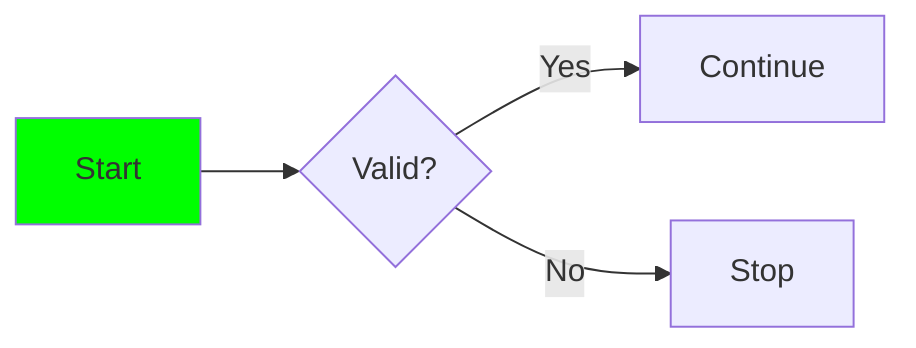

The first node is green in every theme: an explicit `style` is the
author's intent, and the theme adapter must not repaint it.

## State

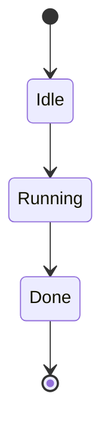

## Sequence — the actor regression

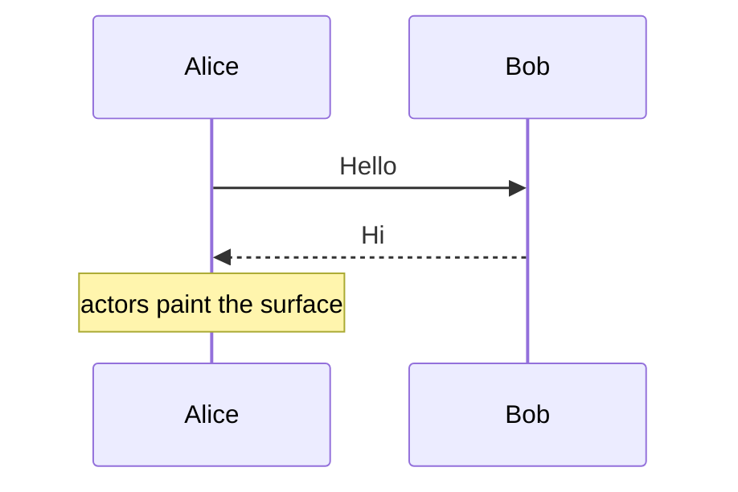

The actor boxes must never catch the theme's link accent — the bug
this showcase guards against.

## ER — the `contains` regression

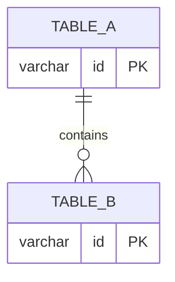

The `contains` relationship label paints the label surface. If it
ever shows the accent color (green in some themes), the
`tertiaryColor` contract has regressed.

## Class

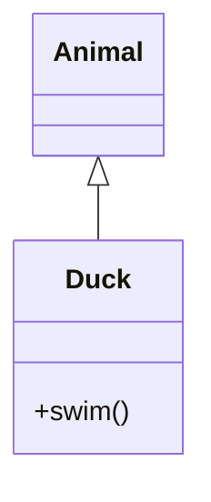

## Requirement

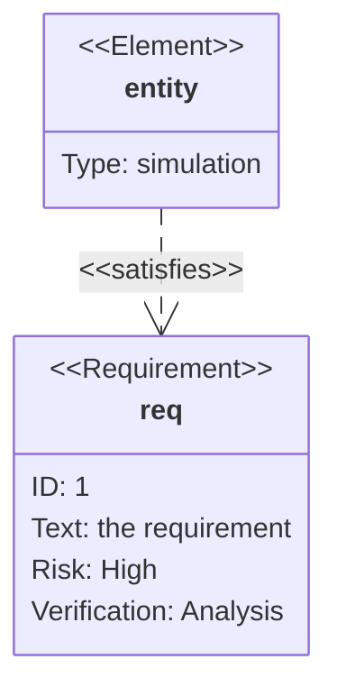

The `satisfies` relation label sits on the label surface, like ER's.

## Architecture

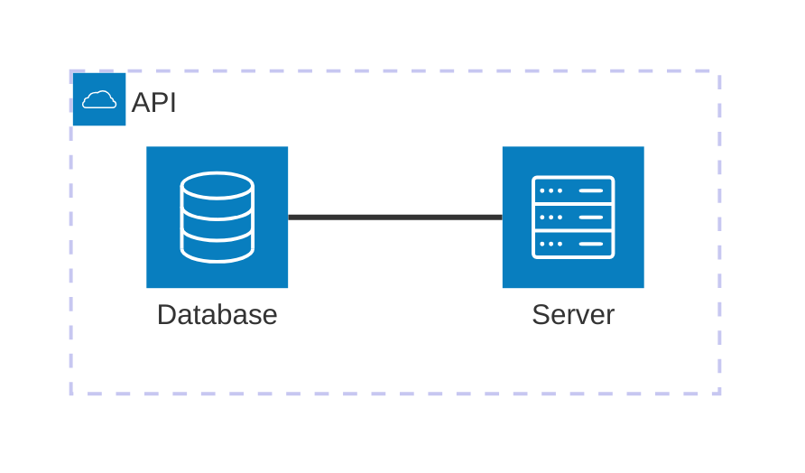

## C4

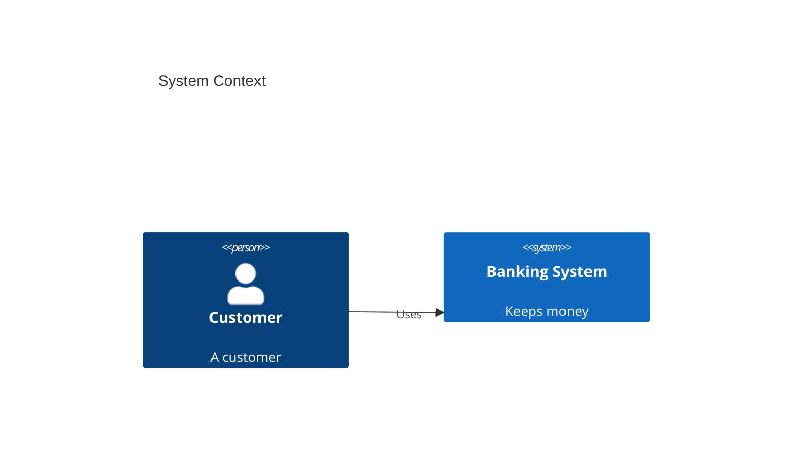

## Block

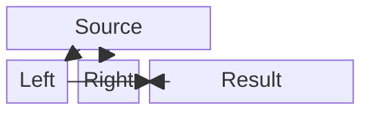

## Kanban

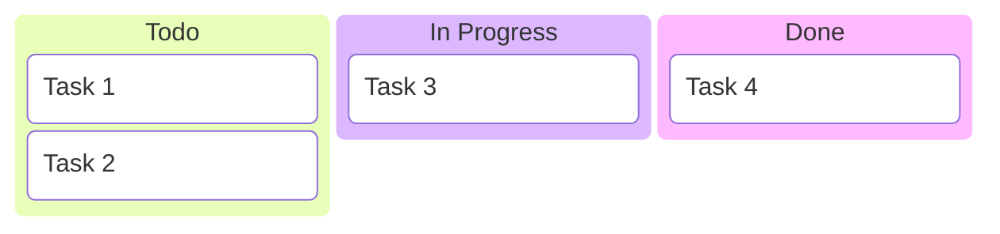

## Gantt — the status regression

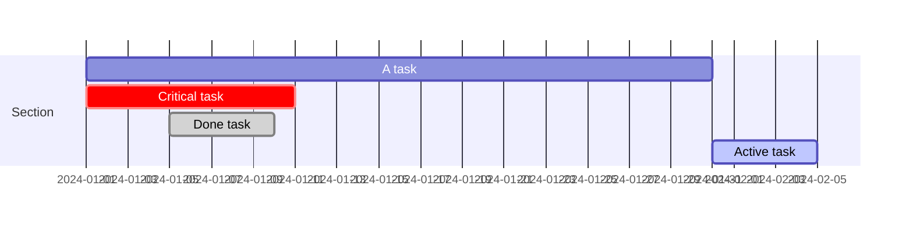

The critical task carries the danger color; done tasks read as
alternate surface; task bars draw series colors with readable labels.

## Timeline

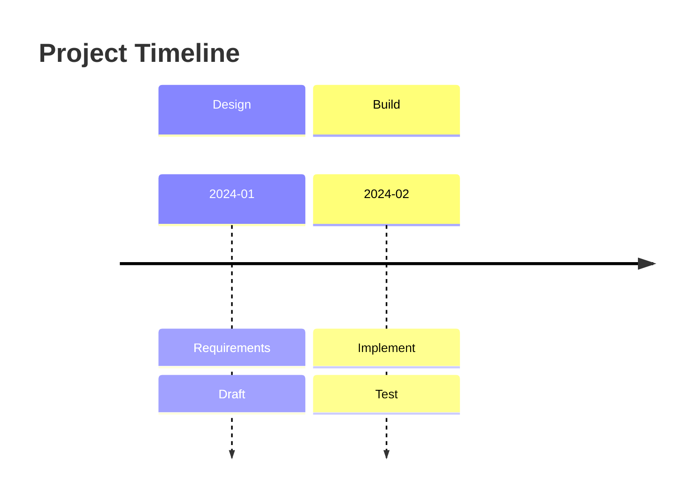

## Journey

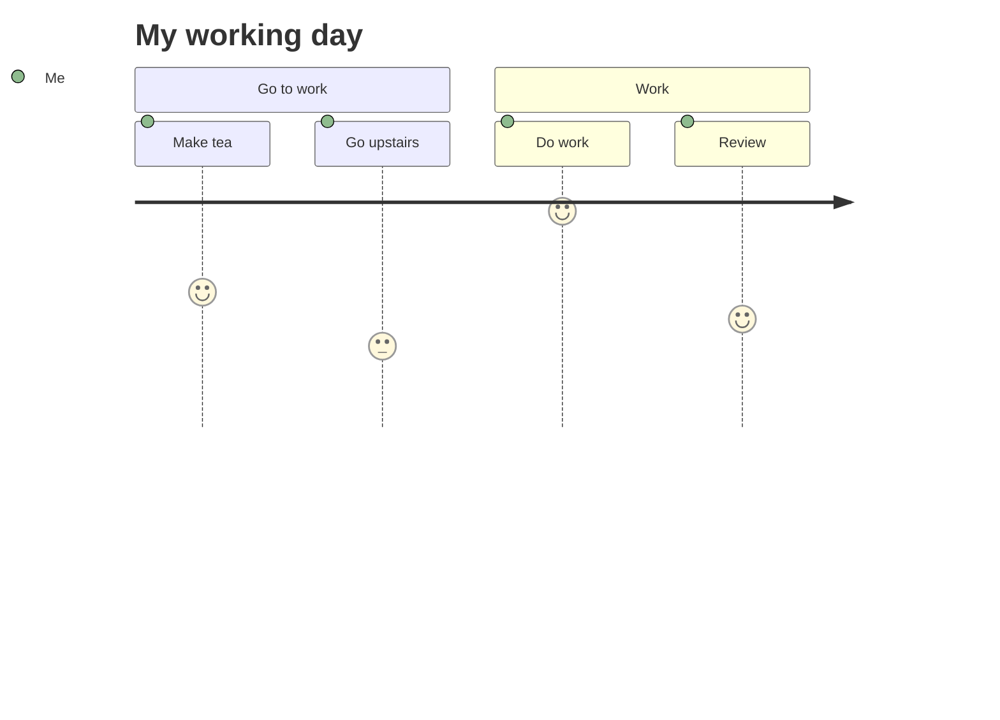

## GitGraph

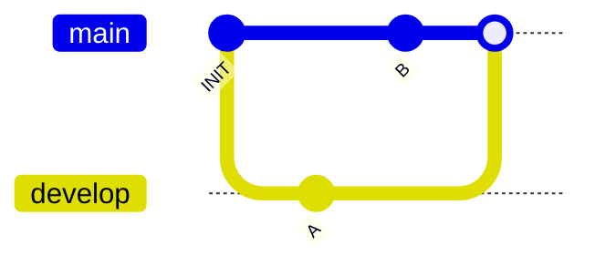

## Pie

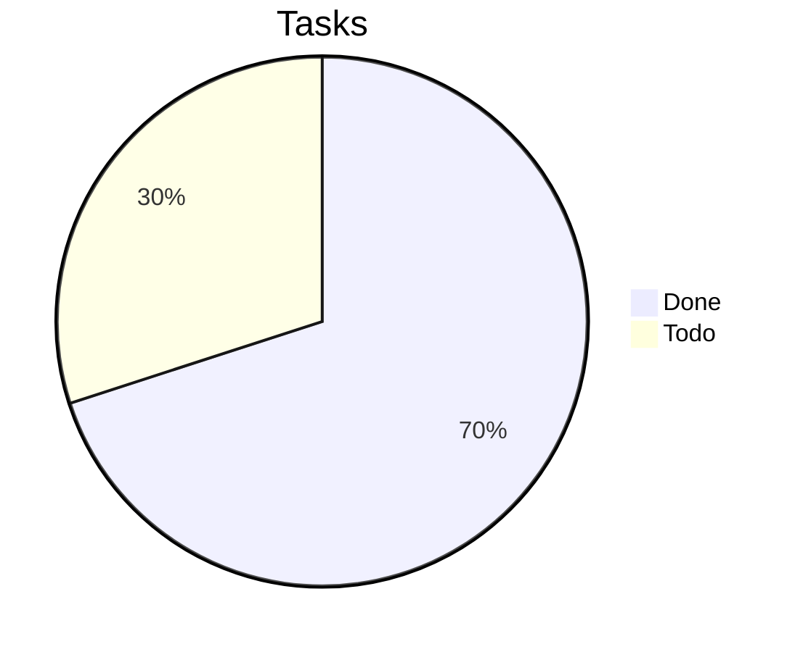

## XYChart

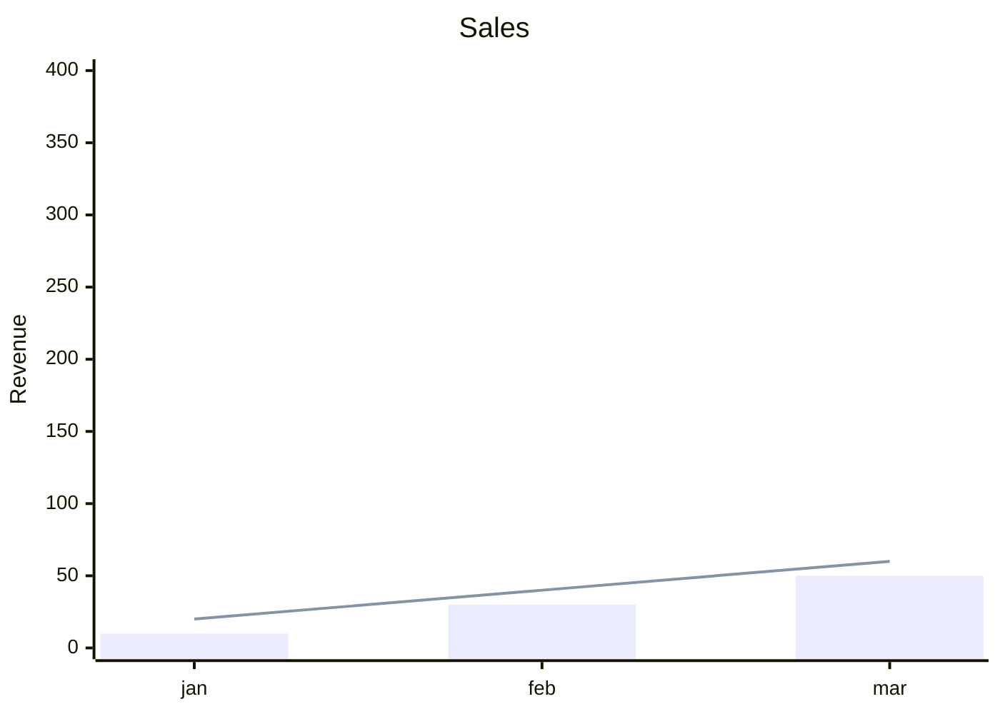

## Radar

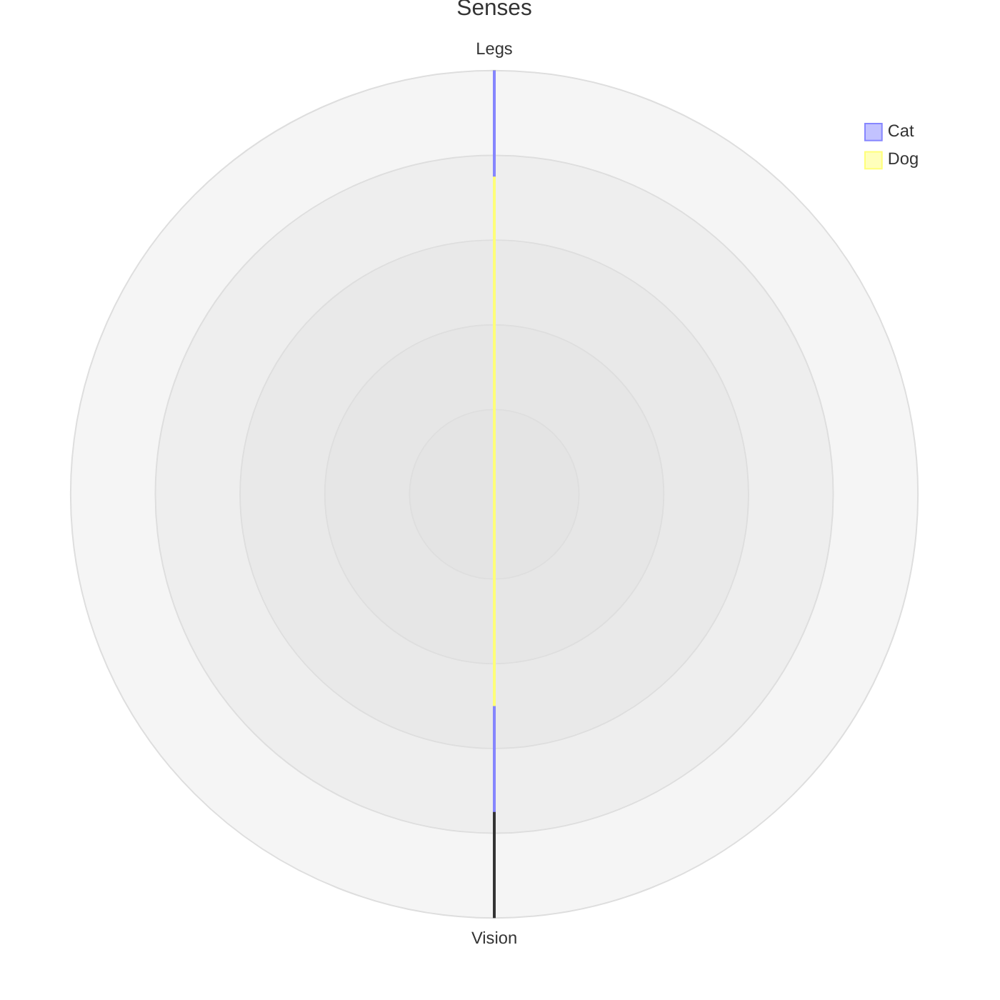

## Sankey

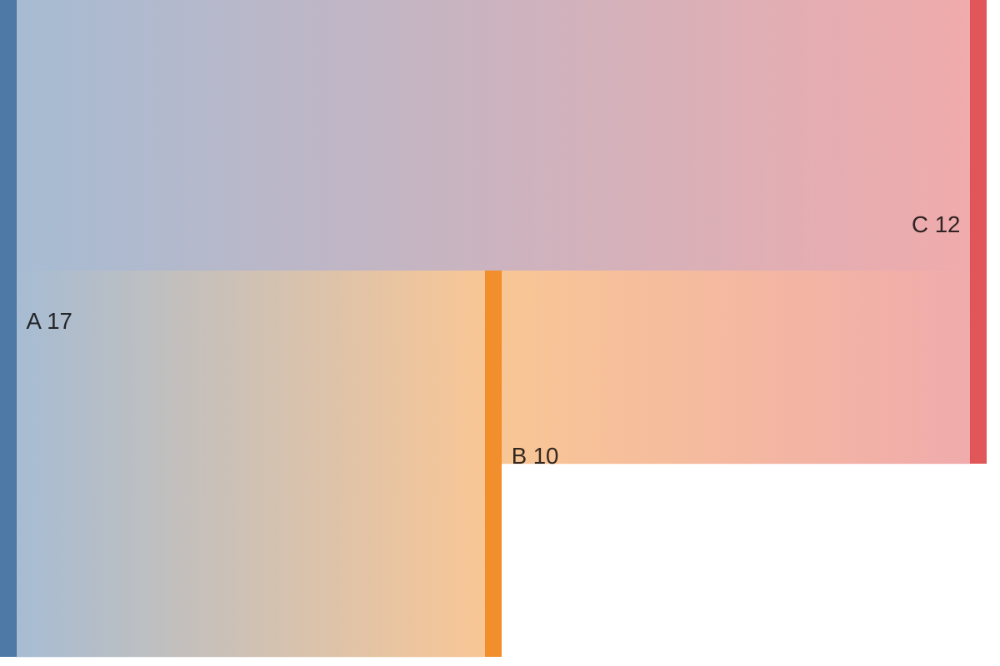

## Treemap

```mermaid
treemap
    title "Disk usage"
    "docs" : 100
    "media" : 250
    "code" : 80
```

## Venn

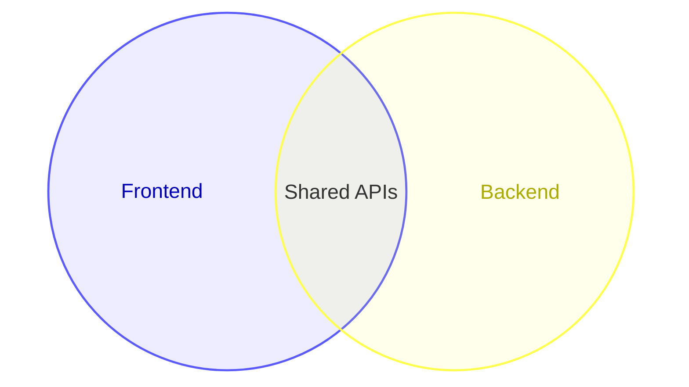
