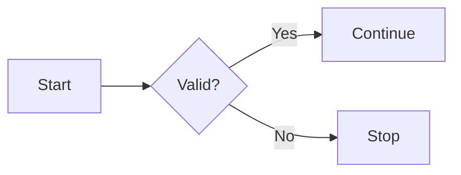
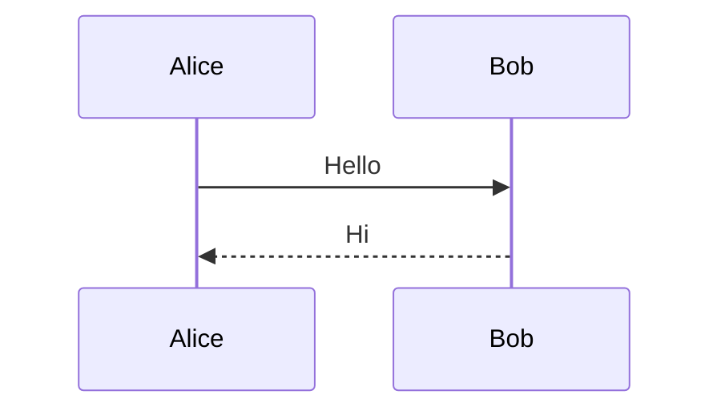
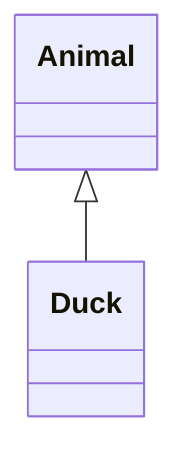
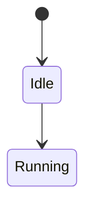
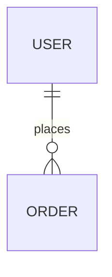
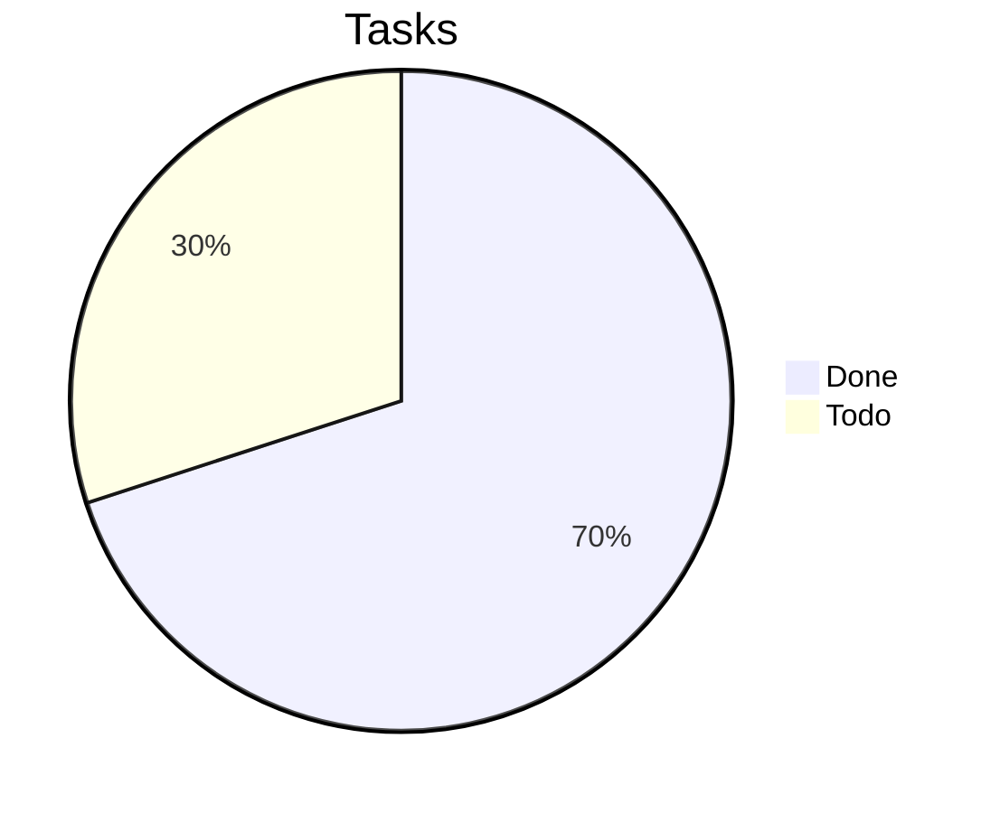
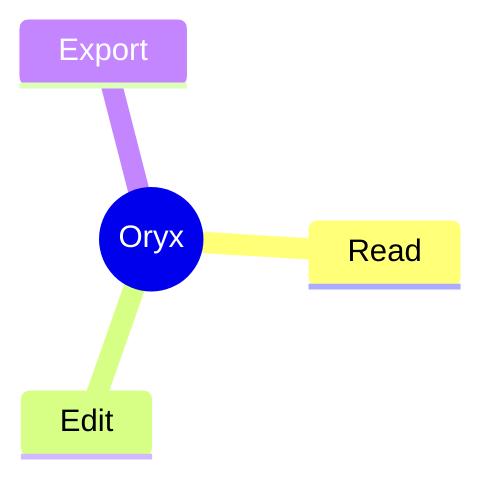
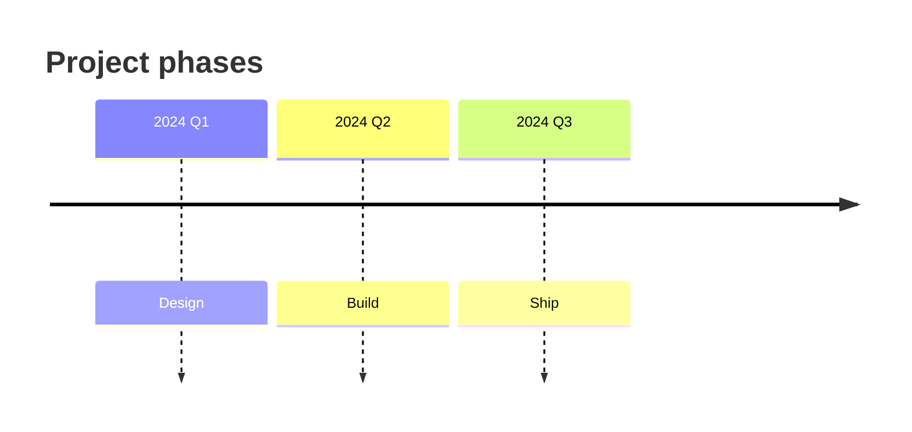
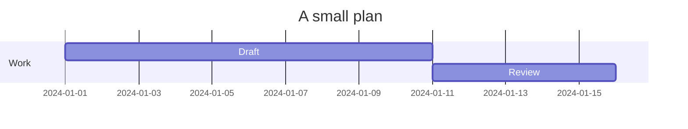

# Mermaid diagrams

Every diagram kind Oryx renders, in one file. The renderer is Merman,
native Rust tracking mermaid.js 11.15; as a separate implementation,
the newest syntax forms may still differ from the JavaScript library.

## Flowchart



## Sequence



## Class



## State



## ER



## Pie



## Mindmap



## Timeline



## Gantt



## Chinese labels


## An invalid diagram

A bad block shows its error panel and the document reads on.

```mermaid
flowchart LR
    subgraph This subgraph never closes
    A --> B
```
